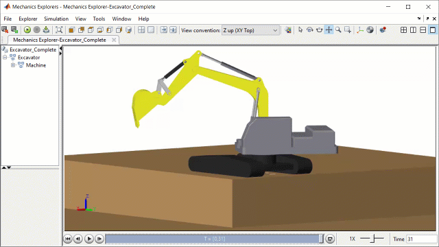
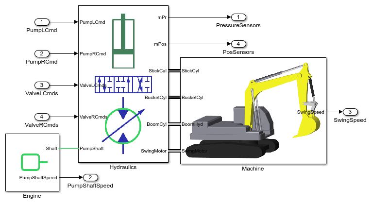
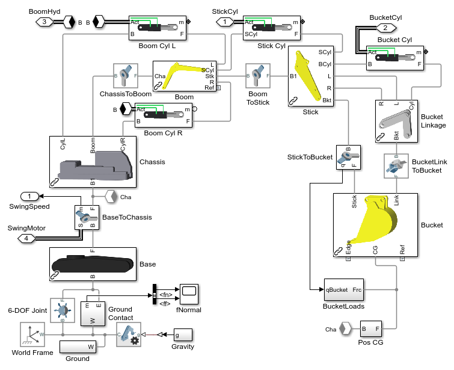
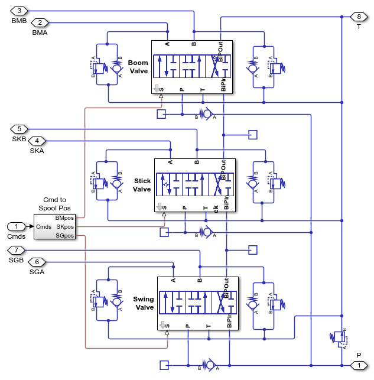

# **Excavator Design with Simscape&trade;**
Copyright 2023 The MathWorks, Inc.

This example models an excavator with hydraulic actuation of the swing motor and 
cylinders for the boom, stick and bucket.  A MATLAB App enables you to explore 
the mechanical and hydraulic design space to calculate digging and lifting forces 
according to international standards.

* **Pin locations** can be adjusted in Excel or in the app. 
* **Digging forces (BOF/TOF)** are calculated according to ISO 6015:2016.
* **Pin loads** are calculated for BOF, TOF, and lift capacity tests.
* **Load charts** are determined at a range of arm positions.
* **Relief pressure thresholds** can be analyzed for each function and the pumps.
* **Hydraulic regeneration valves** are modeled to evaluate efficiency.
* **Dig cycle time and efficiency** are determined in dynamic simulation.
* **Realistic soil loads** are applied to the bucket using Discrete Element Modeling (DEM) software.

Open the project file Excavator.prj to get started.

View on File Exchange:   
You can also open in MATLAB Online: 

## **Excavator Dig Cycle Animation Clip**

## **BOF TOF Calculation, Design Solution App**

## **BOF Calculation, Pressures and Forces**

## **Load Chart, Design Solution App**

## **Excavator Model**

## **Excavator Model, Mechanical System**

## **Excavator Model, Valve Block**

## **Excavator Model, Soil Loads with ThreeParticle/CAE&trade;**

To learn more about modeling and cosimulation with ThreeParticle/CAE&trade; please visit
* [BECKER 3D](https://www.becker3d.com/)
* [Simutopia&reg;](https://simutopia.com/)

To learn more about modeling and simulation with Simscape, please visit:
* [Simscape Getting Started Resources](https://www.mathworks.com/solutions/physical-modeling/resources.html)
* Product Capabilities:
   * [Simscape&trade;](https://www.mathworks.com/products/simscape.html)
   * [Simscape Battery&trade;](https://www.mathworks.com/products/simscape-battery.html)
   * [Simscape Driveline&trade;](https://www.mathworks.com/products/simscape-driveline.html)
   * [Simscape Electrical&trade;](https://www.mathworks.com/products/simscape-electrical.html)
   * [Simscape Fluids&trade;](https://www.mathworks.com/products/simscape-fluids.html)
   * [Simscape Multibody&trade;](https://www.mathworks.com/products/simscape-multibody.html)

